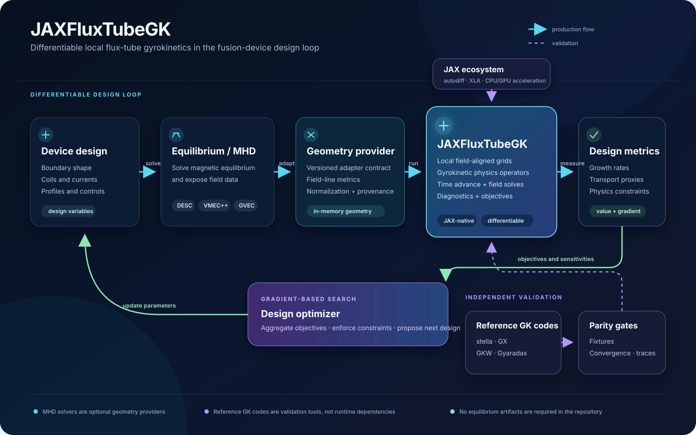

# JAXFluxTubeGK

JAX-first local flux-tube gyrokinetics for magnetic-confinement design.

JAXFluxTubeGK is a standalone linear and nonlinear gyrokinetic solver with a
provider-neutral geometry interface. Any equilibrium code can supply a
magnetic configuration through physical field-line and metric arrays. DESC,
GVEC, and VMEC++ are optional geometry providers; external gyrokinetic codes
are validation references, not runtime dependencies.



## Capabilities

- Provider-neutral stellarator and axisymmetric flux-tube geometry.
- JAX-compatible residuals, time integration, diagnostics, and objectives.
- Linear growth, frequency, mode-structure, and quasilinear objectives.
- Fixed-topology scans and optimization with gradient auditing.
- Collisional, electromagnetic, and nonlinear ExB components.
- Explicit provenance, validation fixtures, and scientific readiness gates.

The solver supports reduced design and validation workflows today. Full
nonlinear turbulence validation and unrestricted end-to-end equilibrium-shape
optimization remain scientific readiness gates; see [STATUS.md](STATUS.md).

## Install

Python 3.11 or newer and `uv` are recommended:

```bash
uv sync --extra dev
```

Run the standalone checks:

```bash
uv run --no-sync pytest tests/test_import.py -q
JAX_ENABLE_X64=1 uv run --no-sync pytest
```

Optional DESC, GVEC, and VMEC++ dependencies are prepared separately:

```bash
uv run --no-sync python scripts/bootstrap_dependencies.py --profile mhd
```

See the [usage guide](docs/usage.md) for environment details and provider
setup.

## First run

Run a reduced stellarator scan by solving the installed named W7-X input with
VMEC++ and consuming its output in memory:

```bash
uv run --extra dev --extra vmecpp python examples/run_stellarator_linear_scan.py
```

The scan produces geometry audits, growth rates, mode structures, convergence
history, and a quasilinear proxy. It is an integration example rather than a
production stellarator-optimization claim. The committed DESC fixture remains
available explicitly with `--geometry-source fixture`.

## Geometry optimization notebooks

The notebooks explain and visualize how an equilibrium provider is connected
to the local GK solver and an optimization loop:

- [DESC geometry optimization](examples/desc_geometry_optimization.ipynb)
- [GVEC geometry optimization](examples/gvec_geometry_optimization.ipynb)
- [VMEC++ geometry optimization](examples/vmecpp_geometry_optimization.ipynb)

They use their live equilibrium providers by default: a named DESC equilibrium,
an in-memory GVEC state, or a named VMEC++ input and solve. File-backed and
synthetic paths are explicit opt-in alternatives. Each notebook shows the
geometry contract, reduced GK objective, solver-side JAX differentiation, an
outer-loop geometry surrogate, and the seam for a real design loop.

Each notebook also runs a real outer-loop hill-climb on one boundary Fourier
harmonic: a 3-point central-difference sensitivity through fresh equilibrium
solves steps the boundary scale for up to 100 iterations, failing closed
(stopping early, keeping every completed iteration) on a solver error or a
wall-clock budget. The resulting objective/boundary-scale trajectory and the
real solved 3D boundary surface every 25 iterations are plotted directly from
each provider's own boundary representation and saved to
`figures/{desc,gvec,vmecpp}_initial_live_design_scan.png` and
`figures/{desc,gvec,vmecpp}_boundary_evolution.png`.

## Geometry interface

All providers resolve to the same versioned contract:

```python
from jax_fluxtube_gk import (
    GeometryRequest,
    SyntheticGeometryProvider,
    internal_geometry_from_result,
    resolve_geometry,
)

request = GeometryRequest(
    configuration="standalone-cosine-B",
    radial_value=0.5,
    alpha=0.0,
    n_z=32,
)
result = resolve_geometry(SyntheticGeometryProvider(), request)
geometry = internal_geometry_from_result(result)
```

Replace `SyntheticGeometryProvider` with `DescGeometryProvider`,
`GvecGeometryProvider`, `VmecppGeometryProvider`, or another adapter without
changing solver construction. Details are in the
[geometry provider contract](docs/geometry_provider.md).

## Documentation

- [Detailed usage and workflows](docs/usage.md)
- [Optimization integration](docs/optimization_integration.md)
- [Geometry provider contract](docs/geometry_provider.md)
- [Dependencies](docs/dependencies.md)
- [Testing](docs/testing.md)
- [API stability](docs/api_stability.md)
- [Performance and differentiability](docs/performance_and_differentiability.md)
- [Current validation status](STATUS.md)
- [Prioritized backlog](TODO.md)

Generate a browsable Doxygen API reference (module index, class graphs, and
call graphs) with:

```bash
uv run python scripts/generate_docs.py --open
```

This requires `doxygen` and, for graphs, `graphviz` (`dot`) on `PATH`. Output
goes to `docs/api/html/` and is not tracked in git; rebuild it locally or in
CI whenever you want an up-to-date reference.

## Repository layout

```text
src/jax_fluxtube_gk/  Public solver package
examples/             Runnable workflows and notebooks
tests/                Unit, validation, and regression tests
scripts/              Provider setup, fixture, audit, and reporting tools
fixtures/             Small versioned numerical contracts
docs/                 User and developer documentation
tex/                  Physics and numerics manuscript
```

Generated equilibria, large traces, caches, checkpoints, and optimization
records belong in caller-owned external storage rather than the repository.
