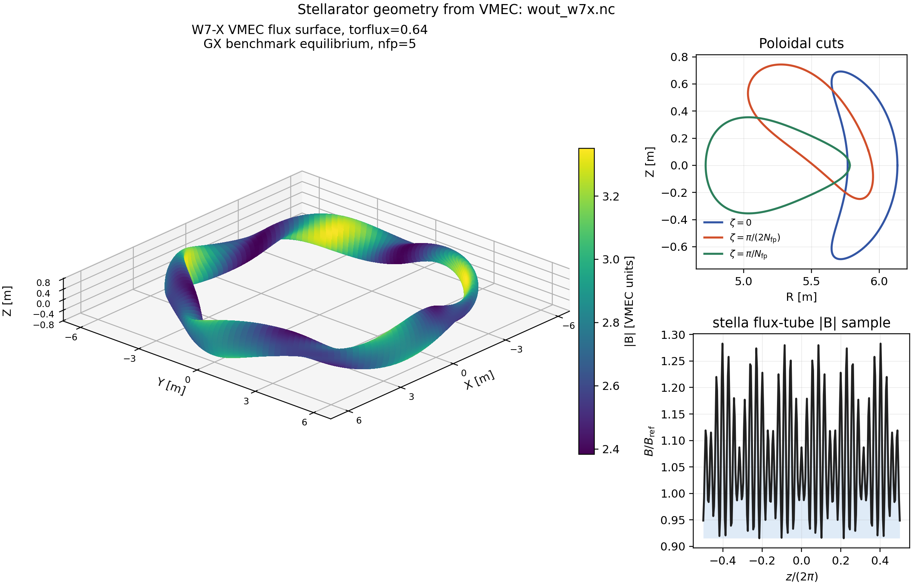

# stellarator-gk

Differentiable local flux-tube gyrokinetics for stellarator design studies.

This repository is a standalone JAX-first implementation of a linear
electrostatic flux-tube gyrokinetic solver. The physics and sign conventions
are aligned with GKW and Gyaradax. DESC, VMEC++, GVEC, GX, and stella are
separately installed geometry providers or validation tools, not vendored
runtime dependencies.

The current production milestone is a trusted linear W7-X stellarator run.  The
code can already run reduced stellarator scans, reduced optimization examples,
Rosenbluth-Hinton and Cyclone gates, and several geometry/code-to-code parity
checks.  Full nonlinear turbulence, production DESC shape optimization,
kinetic-electron TEM validation, collisions, and electromagnetic effects are
explicitly deferred.

## Example Geometry



Regenerate this figure from a user- or provider-supplied VMEC output:

```bash
uv run --no-sync python scripts/visualize_w7x_vmec_geometry.py \
  --vmec /path/to/wout_w7x.nc
```

The image is documentation output; the repository does not provide the W7-X
equilibrium file. The canonical runtime path loads VMEC++'s installed
`w7x-standard` configuration, runs it, and transforms its in-memory `wout`
result without writing an equilibrium file in this repository.

## Repository Map

```text
src/stellarator_gk/      Python package and public solver API
tests/                   Unit, validation, fixture, and regression tests
examples/                User-facing runnable workflows and diagnostics
scripts/                 Fixture generators, external-code prep, audit tools
fixtures/                Small numerical validation contracts
figures/                 Generated CSV/PDF result artifacts for the paper
docs/                    Short developer notes
tex/                     Physics, numerics, and project TeX sources
TODO.md                  Current prioritized backlog
STATUS.md                Current project status and active blocker
```

External MHD and gyrokinetic codes are optional providers and validation
references. Keep their checkouts outside this repository and pass their paths
explicitly to integration workflows; they are not runtime dependencies of the
core solver.

## Install

Use Python 3.11 or newer.  The project is configured for `uv`.

```bash
uv sync --extra dev
```

For stellarator geometry from MHD codes, prepare the pinned provider forks:

```bash
uv run --no-sync python scripts/bootstrap_dependencies.py --profile mhd
```

This fetches, builds, and installs VMEC++, DESC, and GVEC outside the tracked
source tree. Existing sibling clones can be reused without modifying them:

```bash
uv run --no-sync python scripts/bootstrap_dependencies.py \
  --profile mhd --local-root ..
```

GX, stella, GKW, and Gyaradax are validation dependencies and are prepared
separately with `--profile validation`. See
[`docs/dependencies.md`](docs/dependencies.md) for profiles, pinned revisions,
native build requirements, and dry-run/fetch-only options.

For commands that consume these providers, use `.venv/bin/python` or
`uv run --no-sync`; a normal exact `uv` sync intentionally restores the core
lock and removes the external profile.

Use `uv run --no-sync` after the initial sync when a command must not replace a
prepared provider environment. Run `uv sync --extra dev` explicitly when you
want to restore the standalone lock.

For numerical parity tests and production-style diagnostics, enable JAX x64:

```bash
export JAX_ENABLE_X64=1
```

## Quick Checks

Run the import smoke test:

```bash
uv run --no-sync pytest tests/test_import.py -q
```

Run the focused W7-X RHS comparison tests:

```bash
JAX_ENABLE_X64=1 uv run --no-sync pytest \
  tests/test_w7x_ky03_rhs_model_balance.py \
  tests/test_w7x_stella_rhs_trace_comparison.py -q
```

Run the full test suite when changing shared solver behavior:

```bash
JAX_ENABLE_X64=1 uv run --no-sync pytest
```

The default suite excludes explicitly marked external-code integrations and
does not require sibling repositories. To run those checks, pass revision-
checked roots explicitly; see [`docs/testing.md`](docs/testing.md).

Run linting:

```bash
uv run --no-sync ruff check src tests examples scripts
```

These are the same standalone boundaries exercised by GitHub Actions. The CI
job also builds an sdist and wheel, installs the wheel into a fresh environment,
and verifies that `stellarator_gk` imports without repository-relative files.

Build the paper:

```bash
latexmk -pdf -interaction=nonstopmode -halt-on-error -cd tex/main.tex
```

## Run a Reduced Stellarator Scan

The easiest end-to-end run is the reduced stellarator scan:

```bash
uv run --extra dev python examples/run_stellarator_linear_scan.py \
  --output-dir runs/dshape_linear_scan
```

By default this uses the committed DESC DSHAPE fixture
`fixtures/desc_geometry_dshape_rho05_alpha0.npz`.  The command writes:

```text
geometry_audit.json
geometry_audit.csv
ky_growth.csv
mode_structures.csv
convergence_history.csv
convergence_metadata.json
quasilinear_proxy.json
run_config.json
```

The scan can also read:

- `--geometry-source desc-path --desc-path ...` for a DESC equilibrium path,
- `--geometry-provider vmecpp --configuration w7x-standard` for the installed
  live W7-X VMEC++ design, with `--vmec-wout ...` as an interoperability path,
- `--geometry-source eik --eik-reference ...` for GX/GIST/GS2 eik tables,
- `--geometry-source stella-geometry --stella-geometry ...` for stella
  `.geometry` files.

These runs are useful integration checks.  They are not production
stellarator-optimization claims unless the readiness gates pass.

## Public Geometry Provider API

All geometry backends return the same versioned physical contract before the
solver derives its internal coefficients:

```python
from stellarator_gk import (
    GeometryRequest,
    SyntheticGeometryProvider,
    internal_geometry_from_result,
    resolve_geometry,
)

request = GeometryRequest(
    configuration="standalone-cosine-B",
    radial_value=0.5,
    alpha=0.0,
    n_z=32,
)
result = resolve_geometry(SyntheticGeometryProvider(), request)
geometry = internal_geometry_from_result(result)
```

`DescGeometryProvider`, `VmecppGeometryProvider`, `GvecGeometryProvider`,
`GxEikGeometryProvider`, and `StellaGeometryProvider` can replace the synthetic
provider without changing solver construction. VMEC++ runs a packaged named
W7-X input and consumes `VmecOutput.wout` directly; GVEC consumes an in-memory
state or an explicit parameter file and normalizes its SI output to the same
minor-radius/edge-flux contract. File I/O and validation happen before JAX
tracing; continuous in-memory DESC arrays can retain gradients. Native VMEC++
and current GVEC evaluations are declared non-differentiable. Opt-in tests
cross-check direct W7-X geometry against stella, matched GX/GIST, and a common
GVEC/VMEC equilibrium.

Optional geometry caches are explicit and must be outside the source tree.
They preserve the schema and provenance but are non-differentiable after
reload. See [`docs/geometry_provider.md`](docs/geometry_provider.md) for the
complete units, signs, topology, validation, and caching contract.

## Common Workflows

### Validation Gates

Summarize the main reduced validation gates:

```bash
uv run --extra dev python examples/run_validation_gates.py
```

Regenerate validation CSV/PDF artifacts used by `tex/main.tex`:

```bash
uv run --extra dev python examples/generate_validation_gate_figures.py
```

### W7-X Reduced Benchmark

Run directly from the named VMEC++ design after preparing the MHD profile:

```bash
JAX_ENABLE_X64=1 uv run --no-sync python \
  examples/run_stellarator_linear_scan.py \
  --geometry-provider vmecpp \
  --configuration w7x-standard \
  --rho 0.8 \
  --output-dir runs/w7x_vmecpp_linear_scan
```

Generate a reduced W7-X benchmark from explicit GX/GIST geometry and input
paths:

```bash
JAX_ENABLE_X64=1 uv run --no-sync python \
  scripts/generate_w7x_itg_reduced_benchmark.py \
  --eik-reference /path/to/w7x.eik.out \
  --gx-input /path/to/itg_w7x_adiabatic_electrons.in \
  --output-dir /path/to/output
```

Run the W7-X production-readiness ledger:

```bash
JAX_ENABLE_X64=1 uv run python scripts/run_w7x_production_readiness_gate.py
```

The ledger currently remains blocked by open solver/stella mode-structure
parity.  This is intentional: reduced runs should stay reduced until the
external W7-X gate passes.

### Matched stella W7-X Path

The preferred external W7-X reference is stella.  The prepared run directory is:

```text
fixtures/stella_w7x_mode_structure_run/
```

The matched stella fixture has already been exported to:

```text
fixtures/w7x_itg_external_mode_structure_fixture.csv
```

Compare a solver mode-structure fixture against the stella reference:

```bash
JAX_ENABLE_X64=1 uv run python examples/run_w7x_mode_structure_gate.py \
  --observed-fixture fixtures/w7x_itg_stella_matched_time_ladder/runs/time_200/mode_structures.csv \
  --reference-fixture fixtures/w7x_itg_external_mode_structure_fixture.csv \
  --ky-values 0.1,0.2,0.3 \
  --resample-reference-to-observed-z
```

Current status: growth is close at matched `t=200` controls, but the `ky=0.3`
frequency/profile comparison remains open.  The active blocker is direct
term-array parity between the solver and a patched stella RHS trace.

### W7-X `ky=0.3` RHS Trace Work

Regenerate the solver-side W7-X `ky=0.3` RHS/model balance:

```bash
JAX_ENABLE_X64=1 uv run python scripts/audit_w7x_ky03_rhs_model_balance.py \
  --output-dir fixtures/w7x_ky03_rhs_model_balance
```

For direct array comparison, emit the single selected case to external scratch
storage (large numerical traces are deliberately refused inside the repository):

```bash
JAX_ENABLE_X64=1 uv run python scripts/audit_w7x_ky03_rhs_model_balance.py \
  --array-output /tmp/stellarator_gk_w7x_ky03_solver_arrays.npz
```

The archive uses `(z, vpar, mu)` phase-space order and contains coordinates,
quadrature weights, the distribution, potential, individual RHS terms, total
RHS, quasineutrality numerator/denominator, and accumulated log normalization.
For unlike velocity grids, the comparison adapter performs separable linear
complex interpolation onto a common target grid, rejects extrapolation, and
uses that target grid's `w_z*w_vpar*w_mu` quadrature for error norms.
To match the current stella trace time (`code_time=199.9`) and run the partial
weighted comparison:

```bash
JAX_ENABLE_X64=1 uv run python scripts/audit_w7x_ky03_rhs_model_balance.py \
  --n-windows 1999 \
  --output-dir /tmp/stellarator_gk_w7x_ky03_solver_balance_t1999 \
  --array-output /tmp/stellarator_gk_w7x_ky03_solver_arrays_t1999.npz
uv run python scripts/compare_w7x_stella_rhs_trace_to_solver_balance.py \
  --require-raw-trace \
  --solver-balance-dir /tmp/stellarator_gk_w7x_ky03_solver_balance_t1999 \
  --solver-array /tmp/stellarator_gk_w7x_ky03_solver_arrays_t1999.npz \
  --output-dir /tmp/stellarator_gk_w7x_ky03_comparison_t1999 \
  --array-comparison-output /tmp/stellarator_gk_w7x_ky03_array_comparison_t1999.csv
```

The current v2 trace contains three unlabeled RHS calls and lacks stella-side
quasineutrality numerator/denominator and normalization records. The comparator
reports all three calls separately and keeps full parity blocked.

Prepare and run the patched stella RHS trace in a scratch tree:

```bash
uv run --no-sync python scripts/prepare_stella_w7x_rhs_trace_run.py \
  --stella-source /path/to/revision-pinned/stella \
  --vmec-file /path/to/wout_w7x.nc \
  --overwrite \
  --output-root /tmp/stellarator_gk_stella_w7x_rhs_trace
bash /tmp/stellarator_gk_stella_w7x_rhs_trace/build_stella_rhs_trace.sh
bash /tmp/stellarator_gk_stella_w7x_rhs_trace/run_stella_rhs_trace.sh
```

Summarize and compare the trace:

```bash
uv run python scripts/summarize_stella_w7x_rhs_trace.py \
  /tmp/stellarator_gk_stella_w7x_rhs_trace/run/stellarator_gk_w7x_ky03_rhs_trace.dat \
  --stella-source /path/to/revision-pinned/stella \
  --stella-executable \
    /tmp/stellarator_gk_stella_w7x_rhs_trace/stella/COMPILATION/build_cmake/COMPILATION/stella \
  --output fixtures/w7x_ky03_stella_rhs_trace_summary/rhs_trace_summary.json
uv run python scripts/compare_w7x_stella_rhs_trace_to_solver_balance.py \
  --require-raw-trace
```

The committed comparator remains a compact scalar diagnostic. Direct weighted
array parity uses the external raw stella trace and the opt-in solver archive;
neither large array artifact belongs in Git.

### External GX W7-X Cross-Check

GX is a secondary W7-X reference path because it needs a suitable GPU/CUDA
environment.  Package the prepared handoff bundle with:

```bash
uv run python scripts/package_w7x_external_reference_bundle.py \
  --output fixtures/gx_w7x_mode_structure_run/w7x_external_reference_bundle.tar.gz
```

On a GX-capable machine:

```bash
GX_EXECUTABLE=/path/to/gx \
  bash fixtures/gx_w7x_mode_structure_run/run_external_reference.sh
```

After returned GX outputs are copied back:

```bash
bash fixtures/gx_w7x_mode_structure_run/ingest_returned_outputs.sh \
  --copy-outputs --resample-reference-to-observed-z
```

## Using the Python API

The examples are the best starting point.  For direct API use, build grids and
geometry first, then build a reusable residual precompute object.

```python
import jax.numpy as jnp

from stellarator_gk import (
    AdiabaticElectronParams,
    FourierGridSpec,
    GeometryScalarParams,
    ParallelGridSpec,
    SpeciesParams,
    VelocityGridSpec,
    build_fourier_grid,
    build_linear_residual_precompute,
    build_parallel_grid,
    build_s_alpha_geometry,
    build_velocity_grid,
    linear_residual,
)

velocity = build_velocity_grid(
    VelocityGridSpec(n_vpar=7, n_mu=5, vpar_max=2.0, mu_max=1.5)
)
parallel = build_parallel_grid(
    ParallelGridSpec(n_z=16, z_min=0.0, z_max=1.0, topology="periodic")
)
fourier = build_fourier_grid(
    FourierGridSpec(n_kx=3, n_ky=2, kx_max=0.6, ky_values=(0.0, 0.4))
)
geometry = build_s_alpha_geometry(
    parallel, GeometryScalarParams(q=1.3, shat=0.7, eps=0.18)
)
ion = SpeciesParams(
    charge=1.0,
    mass=2.0,
    density=1.0,
    temperature=1.0,
    density_gradient=1.0,
    temperature_gradient=3.0,
)
electrons = AdiabaticElectronParams(density=1.0, temperature=1.0)

precompute = build_linear_residual_precompute(
    velocity,
    parallel,
    fourier,
    geometry,
    ion,
    electron_params=electrons,
)

state_shape = (
    velocity.vpar.size,
    velocity.mu.size,
    parallel.z.size,
    fourier.kx.size,
    fourier.ky.size,
)
state = jnp.zeros(state_shape, dtype=jnp.complex128)
rhs = linear_residual(state, precomputed=precompute)
```

Important API rule: grid sizes, derivative backends, mode connectivity, and file
I/O are static topology.  Continuous geometry arrays, species/profile
parameters, RHS terms, field solves, time steps, diagnostics, and objectives are
the differentiable path.

## Current Validation Status

Passing guardrails:

- Rosenbluth-Hinton late-plateau gate.
- Cyclone selected-ky scalar growth gate.
- Cyclone term-level and GKW RHS/action parity gates.
- DESC/GX/GX-GIST eik geometry contracts.
- Reduced stellarator scan and fixed-topology optimization plumbing.

Open blockers:

- matched W7-X solver/stella `ky=0.3` frequency/profile parity,
- direct weighted term-array parity against the patched stella RHS trace,
- production W7-X convergence and CPU timing after parity,
- full nonlinear turbulence and full DESC optimization.

Read `STATUS.md` for the latest state and `TODO.md` for the next concrete
tasks.

## Development Notes

- Keep new physics and numerical schemes documented in `tex/main.tex`.
- Add focused tests for every new public function in `src/`.
- Prefer small explicit fixture contracts over hidden convention fixes.
- Keep integer topology outside JAX gradient-traced paths.
- Do not label reduced examples as production physics results.

Useful companion docs:

- `docs/performance_and_differentiability.md`
- `docs/optimization_integration.md`
- `TODO.md`
- `STATUS.md`
